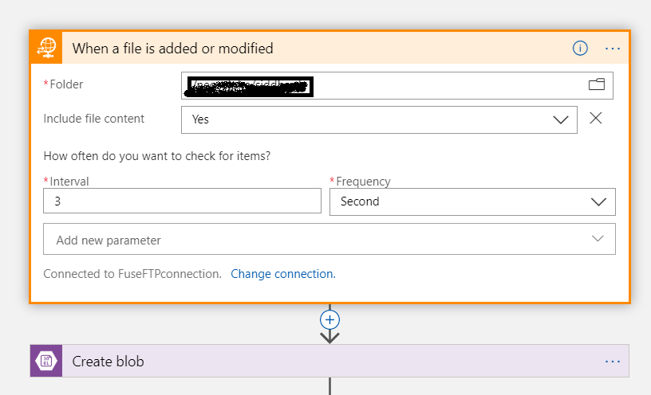
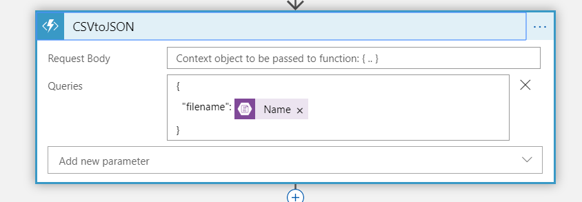
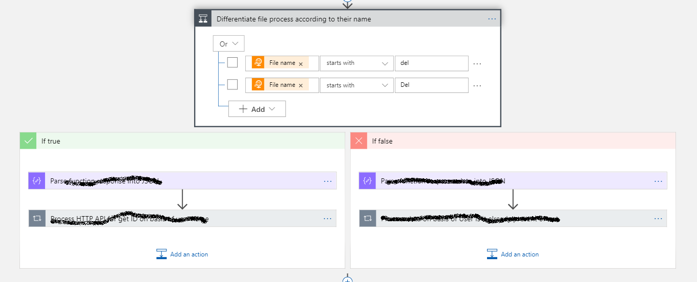
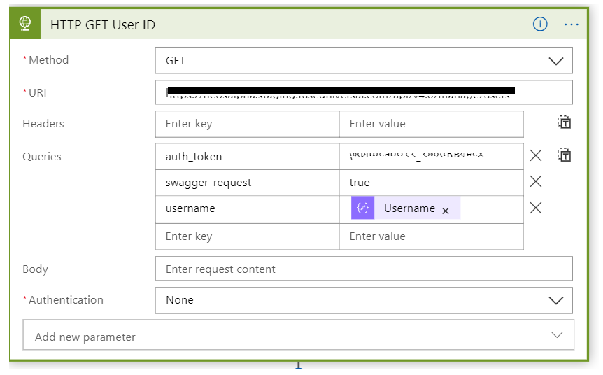

# Integration Scenario: Configure FTP Trigger, Function App and HTTP(Third Party Rest API) Activity in Logic App Using Azure.
**Produced by NeosAlpha Technologies**

# Introduction
In this demo we are configuring logic App which automatically trigger when any CSV file create or modified on FTP server. Now we copy that file from FTP server to Azure blob storage. We are using Function App for Trasform csv file data into JSON format.
For configure Third Party REST API we are using HTTP activity in logic App for further Process.

# Soltion Architecture Design

# Set up
In the Logic App interface, go to the Logic App designer and add a FTP activity.
Get file from FTP server to azure blob storage.Now, Create a HTTP Trigger- Function App in visual studio. In this Function App we are reading CSV file data, which stored in Azure blob storage and convert that data into JSON format and publish this code to Azue cloud services from VS. 
Functionality we are including in this Process:

•	Auto event occur when new file is created or modified on FTP server.

•	Copy file from FTP server to Azure Blob Storage

•	Transform CSV file into JSON format using Azure Function App HTTP Trigger.

•	Perform Various Http Request Type like PUT/POST/DELETE using Logic App and configure REST API.

•	Manage Proper Error Handling.

•	Configure Azure Log Analytics.

# Function App

HTTP Trigger Function App is configure with Azure Blob storage. File name we are passing through Function App Query string. Read File data and convert data into JSON format.
Code will be like:
      
        [FunctionName("CSVtoJSON")]
        public static IActionResult Run([HttpTrigger(AuthorizationLevel.Function, "get", "post", Route =null)] HttpRequest req
        , [Blob("hotfile/{query.filename}", FileAccess.Read, Connection = "AzureWebJobsStorage")]Stream myBlob, TraceWriter log)
        {
            log.Info("C# HTTP trigger function processed a request.");
            string name = req.Query["name"];
            var json = Convert(myBlob);
            return (ActionResult)new OkObjectResult(json);
           
        }
        public static string Convert(Stream blob)
        {
            // Properties per = new Properties();
            //List<Properties> records = new List<Properties>();
            var sReader = new StreamReader(blob);
            var csv = new CsvReader(sReader);

            csv.Read();
            csv.ReadHeader();

            //*** To add into list without customization ***//
            var csvRecords = csv.GetRecords<object>().ToList();

            return JsonConvert.SerializeObject(csvRecords);
        }

# Logic App
Go to the Logic App designer and add a FTP Activity, It will auto trigger when new file added or modified on configured FTP Server.Use Create blob Activity for copy file into Blob storage container from FTP server.

We are configuring Function App for transform CSV data into JSON format. Here we are passing filename in Function App query input block.

We are using if condition in Logic App for define next step. If File name contain del keywords, its mean condition is True then Steps define in True condition will execute other wise steps defined in false block will process.

In Logic App we are using HTTP activity for configuring Third Party API. Here we are using Third Party API URL with Authorisation Key and Required inputs in Body section in JSON Format.

